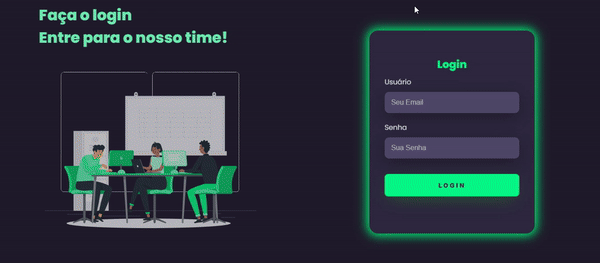
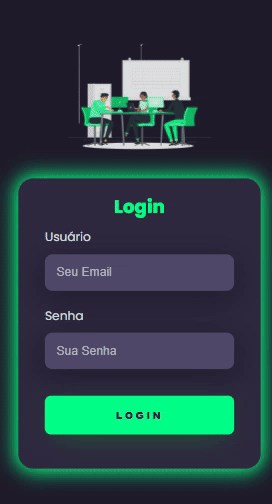

# Página de Login 

## Resumo
Esta é uma página de [Login](https://ezequiel-lee.github.io/login/) interativa e responsiva onde eu coloquei em prática as tecnologias de HTML e CSS.

O projeto consiste em uma interface interativa e responsiva, onde foi usado várias keyframes para uma interface com leves animações (fadeIn, fadeInLeft, fadeInDown e pulse)

## Tecnologias Utilizadas

  
	

## Veja o funcionamento!
### Desktop

Neste GIF animado, você pode conferir o projeto no Desktop em pleno funcionamento e responsivo.

### Mobile

Neste GIF animado, você pode conferir o projeto no Mobile em pleno funcionamento e responsivo.

## Acesse o Projeto!

Você pode acessar o projeto através do link abaixo:

➜ [Link da página de Login](https://ezequiel-lee.github.io/login/)

